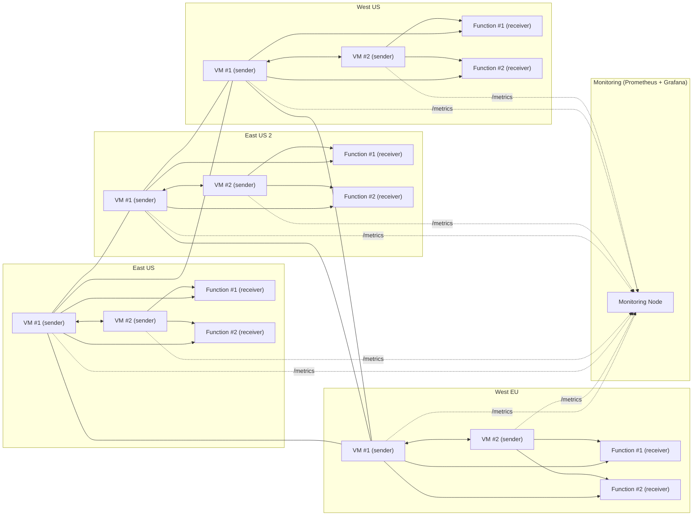

# Geo-Distributed Infra - Agentic Plan

## Abstract

This project aims to investigate how network performance is affected by geographically-distributed VMs and Functions. The research should show how the following communication patterns:

1. Intra-region VM -> VM
2. Inter-region VM -> VM
3. Intra-region VM -> Serverless
3. Inter-region VM -> Serverless

Affect networking metrics such as packet loss, throughput, and latency. Involved tools may be `ping`, `iperf`, etc.

### Tech Stack

- Terraform
- Prometheus
- Grafana
- Azure (VMs + Functions)

## File Structure

```
/geo-distributed-vms/
├── main.tf            
├── modules/              
│   ├── function    // reusable module to deploy X functions in a region R, return URLs for scraping
│   ├── vm          // reusable module to deploy X VMs in region R, return IP/port + URLs for scraping
│   ├── monitor     // reusable module to deploy a monitoring node in region R, return IP/port for Prom/Grafana
```

## Architecture

This section will detail what resources will be deployed, as well as how they communicate with one another.

### Resources and Endpoints

- Four *Worker Node* Regions (East US, East US 2, West US, West EU)
    - Two VMs
        1. `probe` - Probe targets and expose Prometheus Exporter
        2. `\recv` - HTTP Echo Server for responding to requests
    - Two Serverless Functions
        1. `\recv` - HTTP Echo Server for responding to requests

Worker nodes should have consistent settings when possible. All should contain a simple HTTP echo server, and a way to hit `\metrics` to the monitoring node. It is assumed that any dependencies will be created, and shared between resources when possible.

- *Monitoring Node* - Within one arbitrary region, serves as a host for Prometheus data and Grafana visualization.
    - Pull model exporter; will probe VM to communicate and collect metrics from other workers

### "Fan-out" Exporter

Flow of command:

1. Every X seconds, monitor will probe VMs through a custom exporter.
2. The custom exporter will blackbox probe all other worker IPs, and collect networking metrics from the communication.
3. The custom exporter will return metrics back to Prometheus "flattened." That is: Prometheus should be able to understand that the one exporter outputs really represent multiple outputs.

### Communication

Communication will be done over the internet using public IPs for the MVP/simplicity.

1. There should be repeated all-to-all communication every second between workers where network metrics are collected by the sender.
2. Whenever workers make a connection, the sender node should report its collected metrics to the monitor via `\metrics`.



## Networking Metrics

Whatever Prometheus gives us, could include:

`probe_rtt_ms_bucket{src_region=..., dst_region=..., dst_type="vm|func"}`

`probe_packet_loss_ratio{...}`

`probe_throughput_mbps{...}`

`probe_http_requests_total{status="200", dst_type="vm|func", ...}`

`probe_http_request_latency_ms_bucket{...}`

`probe_connect_failures_total{reason="timeout|dns|tcp_reset", ...}`
